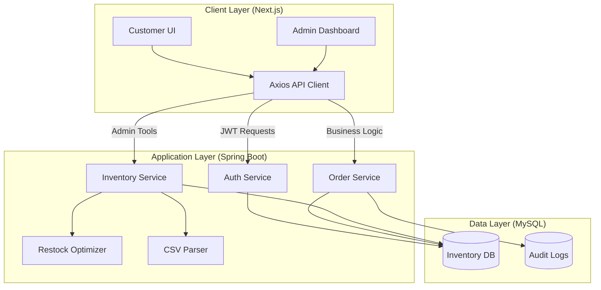
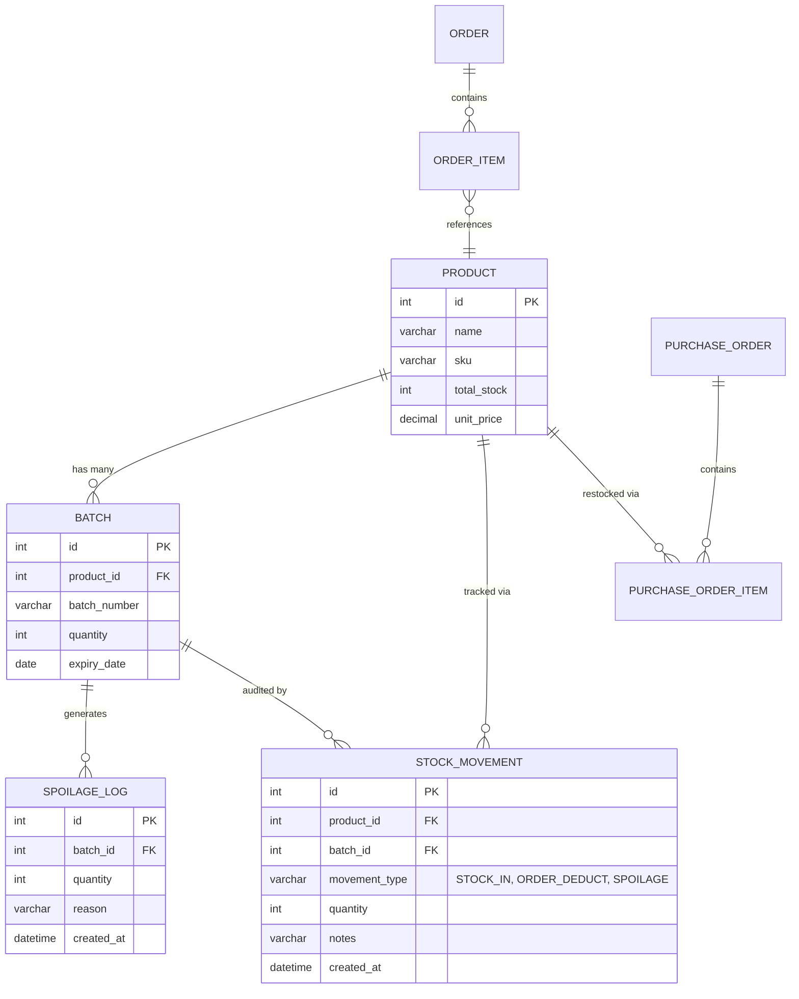
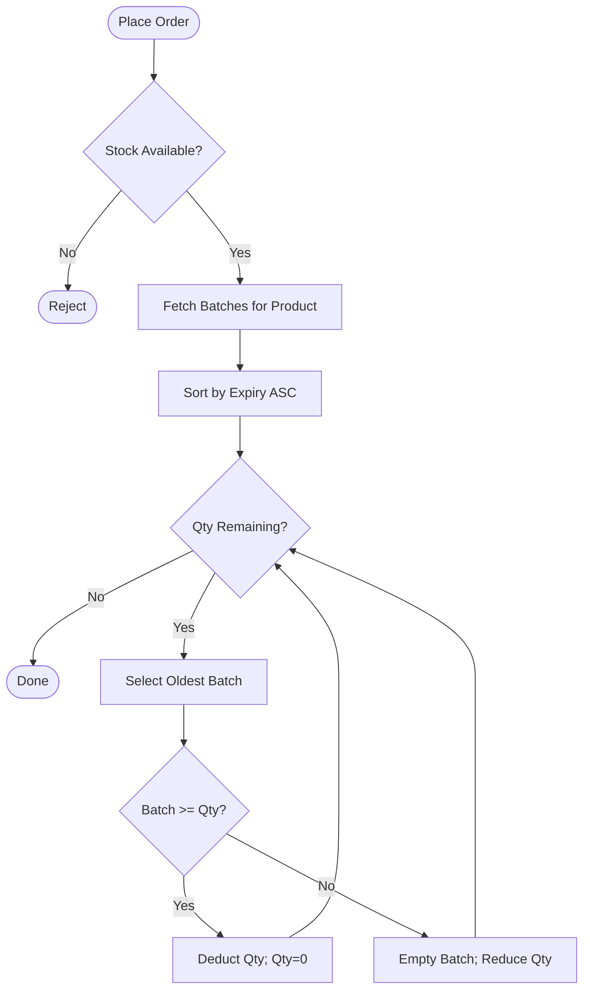
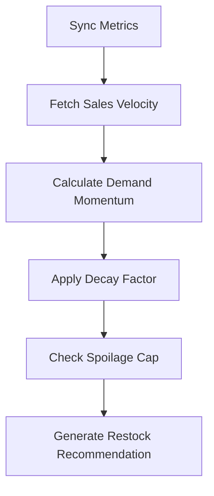

## 4.1 Introduction
The design phase is critical for ensuring the system can handle the complexities of batch-level inventory tracking and real-time restocking analytics. The proposed architecture prioritizes scalability, transactional integrity, and a clean separation of concerns between the user interface and the backend logic.

## 4.2 Architectural Design
The system follows a **Client-Server Architectural Model**, which allows for a decoupled development process and clear role boundaries between the frontend and backend. 

### 4.2.1 System Block Diagram
The System Block Diagram illustrates the interaction between the user interfaces, the core application services, and the data persistence layer.


*Figure 4.1: System Block Diagram showing the separation of concerns and data flow.*

### 4.2.2 Technology Stack
As established in the block diagram, the stack is chosen for its industrial reliability:
- **Presentation:** Next.js (React) provides a responsive and dynamic interface for both customers and administrators.
- **Logic Engine:** Spring Boot (Java 17) manages the enterprise-level threading and transactional logic required for batch-spillover and predictive analytics.
- **Persistence:** MySQL 8.0 ensures ACID compliance, which is critical for preventing data corruption during high-concurrency inventory deductions.

## 4.3 Use Case Diagram
The Use Case Diagram defines the interactions between the system's actors (Customer and Administrator) and the core functional modules, including inclusion and extension relationships.

```mermaid
useCaseDiagram
    actor Admin
    actor Customer

    package "Integrated E-Commerce Inventory System" {
        usecase "Log In" as ALin
        usecase "Verify email and password" as VEP
        usecase "Manage Products" as MP
        usecase "Manage batches with expiry dates" as MB
        usecase "Log Spoilage" as LS
        usecase "View Spoilage History" as VSH
        usecase "View Restocking Alerts" as VRA
        usecase "Restock With Bulk Upload (CSV)" as RBU

        usecase "Log In" as CLin
        usecase "Browse products" as BP
        usecase "Filter products" as FP
        usecase "View Product Details" as VPD
        usecase "Add products in carts" as APC
        usecase "Checkout" as CO
        usecase "Register account" as RA
        usecase "Check Order Detail" as COD
        usecase "Cancel Order" as CnO
        usecase "Add Address" as AA
    }

    Admin --> ALin
    Admin --> MP
    Admin --> LS
    Admin --> VRA
    Admin --> RBU

    ALin ..> VEP : <<include>>
    MP ..> MB : <<include>>
    VSH ..> LS : <<extend>>

    Customer --> CLin
    Customer --> BP
    Customer --> APC
    Customer --> RA
    Customer --> COD
    Customer --> AA

    CLin ..> VEP : <<include>>
    FP ..> BP : <<extend>>
    VPD ..> BP : <<include>>
    CO ..> APC : <<extend>>
    CnO ..> COD : <<extend>>
```
*Figure 4.2: Final Use Case Diagram of the project.*

## 4.4 Entity-Relationship Diagram (ERD)
The database schema was designed to support granular tracking of perishable goods through a batch-centric model.


*Figure 4.1: Final Entity Relationship Diagram (ERD)*

The inclusion of the `BATCH` table allows for multiple expiry dates per `PRODUCT`, which is the technical requirement for FEFO logic. The `STOCK_MOVEMENT` table serves as a permanent audit trail for all quantity changes.

## 4.4 High-Level Flow Diagrams
The interaction between the two primary user roles—Administrator and Customer—is governed by distinct but interconnected workflows.

### 4.4.1 Administrator Flow
Administrators focus on inventory lifecycle management. This begins with bulk CSV uploads to onboard stock, followed by continuous monitoring via the restock dashboard and manual spoilage logging when goods are damaged or expired.

### 4.4.2 Customer Flow
Customers interact with the sales interface. The flow encompasses product discovery, cart management, and the checkout process. Behind the scenes, every checkout triggers an automatic inventory search and deduction across the database batches.

## 4.5 Activity Diagrams (Logic Modeling)
Detailed activity diagrams were developed to refine the complex backend logic required for perishables management.

### 4.5.1 FEFO Deduction Logic
The FEFO (First-Expired, First-Out) logic is essential for reducing waste. The system automatically prioritizes the earliest expiring batch during the checkout sequence.


*Figure 4.2: Activity Diagram for FEFO Deduction Logic*

### 4.5.2 Predictive Restocking Logic
The restocking algorithm is an adaptive model that incorporates demand momentum and spoilage constraints to prevent over-ordering.


*Figure 4.3: Activity Diagram for Predictive Restocking*

## 4.6 Summary
Chapter 4 translated the project's functional requirements into a cohesive technical design. Through the use of a Client-Server architecture, a batch-aware database schema, and rigorous logic modeling, the system design ensures that the final implementation can reliably manage the inventory needs of a modern grocery e-commerce business.
