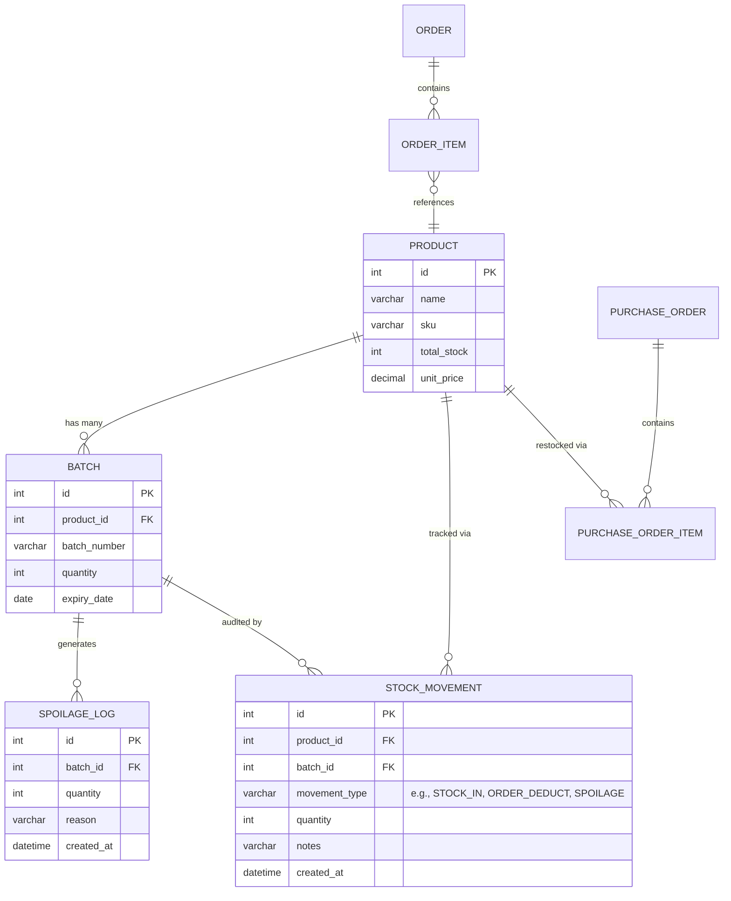
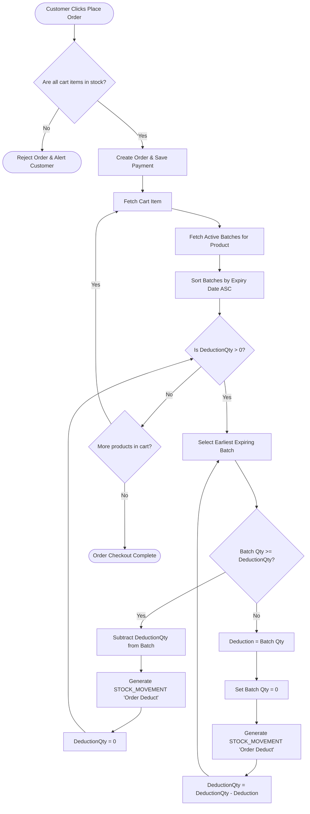
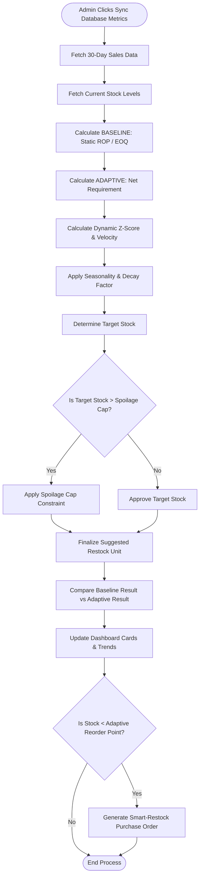

# Chapter 4: System Design Updates (FYP2)

This document contains the updated diagrams you need to include in your Chapter 4 to reflect the advanced systems you built during FYP2. You can use a tool like [Mermaid Live Editor](https://mermaid.live/) to convert these code blocks into high-quality images for your Word document, or screenshot them directly if your markdown viewer supports them!

## 1. Updated Entity Relationship Diagram (ERD)
You need to show the examiners that you updated the database schema to support the new features (Batches, Stock Movements, Purchase Orders, and Spoilage). 

*Figure 4.x.x: The updated logical Entity Relationship Diagram showing the relationships necessary for batch-level tracking, audit trails, and purchasing.*

---

## 2. Activity Diagram: FEFO (First-Expired, First-Out) Deduction
This diagram shows the complex workflow your Spring Boot backend runs when a customer checks out, proving to the examiners how you handled the batch-spillover logic.

*Figure 4.x.x: Activity diagram illustrating the recursive FEFO batch deduction process during customer checkout.*

---

## 3. Activity Diagram: Adaptive Predictive Restocking Algorithm
This diagram maps out how your new `Algorithm Evaluation Dashboard` decides exactly how many units to reorder by comparing the baseline (legacy) versus the adaptive algorithm.

*Figure 4.x.x: Activity diagram detailing the calculation flow of the Adaptive Predictive Restocking Algorithm including Spoilage Prevention constraints.*
